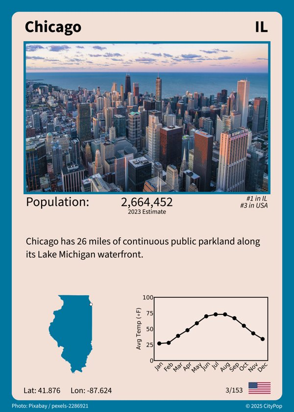
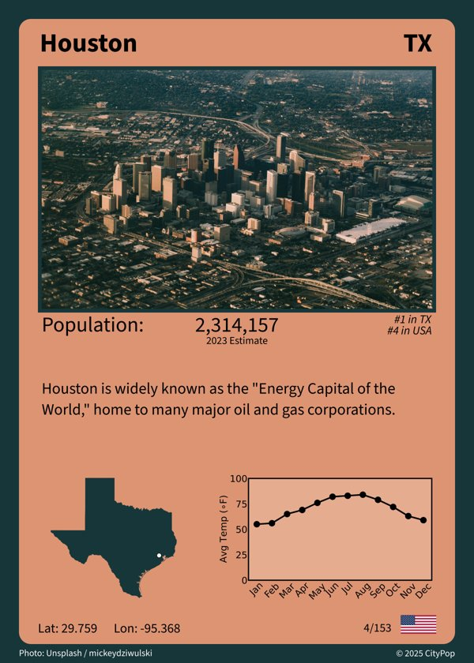
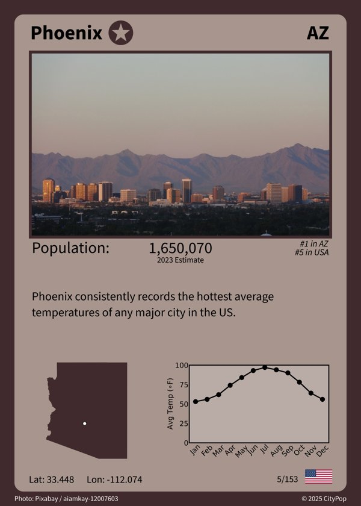
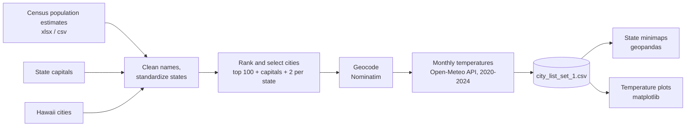

# US City Cards

A data pipeline that builds the dataset behind a set of 153 collectible trading cards, one for each of the most populous US cities, every state capital, and at least two cities per state (50 states plus DC).

Each card shows the city's population, its rank nationally and within its state, a location marker on a state map, and a chart of average monthly temperatures. This repo covers the data engineering: sourcing, cleaning, selecting, geocoding, weather ingestion, and asset generation. The card layouts themselves were designed separately in Canva and Photoshop.

## Card previews

<p>
  
  
  
  
</p>

Full card set: [link to full set](#)

Photo credits for the previews: Los Angeles, Unsplash / pemarroquinmtz. Chicago, Pixabay / pexels-2286921. Houston, Unsplash / mickeydziwulski. Phoenix, Pixabay / aiamkay-12007603. Credits for every card are in `data/processed/card_data_set_1.csv`.

## Pipeline



## What each step does

1. **Clean and select** (`notebooks/01_build_city_list.ipynb`)
   - Splits the Census "City, State" field and strips suffixes like "city", "town", and "village"
   - Renames merged city-county governments (Nashville, Louisville, Lexington) to their common names
   - Appends state capitals and Hawaii cities, which the Census table does not cover (it lists places of 20,000+ residents)
   - Computes overall and within-state population ranks
   - Keeps the 100 most populous cities, all capitals, and the largest remaining city for any state with only one selection, so every state has at least two cards
2. **Geocode**: Nominatim (OpenStreetMap) returns latitude and longitude, with retry handling for timeouts.
3. **Weather ingestion**: the Open-Meteo historical archive API returns daily mean temperature for 2020-2024. Values are converted to Fahrenheit and averaged by calendar month, with exponential backoff on rate limits (HTTP 429).
4. **Asset generation** (`02_state_minimaps.ipynb`, `03_temperature_plots.ipynb`): one state outline per city with a location marker, and one temperature chart per city.

## Output

`data/processed/city_list_set_1.csv` has one row per city:

| Column | Description |
|---|---|
| City, State, State ID | Location |
| Capital | YES / NO |
| 2023 Est | Census population estimate |
| Overall Rank, State Rank | Population rank nationally and within the state |
| Latitude, Longitude | From Nominatim |
| Jan - Dec | Average temperature (F), 2020-2024 |

`data/processed/card_data_set_1.csv` adds card fields (state colors, photo attribution).

## Repo layout

```
us-city-cards/
├── data/
│   ├── raw/            # Census estimates, capitals, Hawaii cities, shapefiles
│   └── processed/      # final datasets
├── notebooks/          # run in numbered order
├── docs/images/        # card previews and sample assets
├── requirements.txt
└── README.md
```

## How to run

```bash
python -m venv .venv
source .venv/bin/activate
pip install -r requirements.txt
cd notebooks
jupyter notebook
```

Run the notebooks in order, from inside `notebooks/`. Notebook 01 takes roughly 15 minutes because it rate-limits itself against the free geocoding and weather APIs. Generated images are written to `outputs/`, which is not tracked.

## Tools

Python, pandas, geopandas, matplotlib, geopy, requests, Jupyter

## Data sources

- Population: [US Census Bureau city and town population estimates](https://www.census.gov/data/tables/time-series/demo/popest/2020s-total-cities-and-towns.html), Vintage 2023 release (the page now lists newer vintages)
- Geocoding: [Nominatim](https://nominatim.org/), data (c) OpenStreetMap contributors, ODbL
- Weather: [Open-Meteo](https://open-meteo.com/) historical archive, CC BY 4.0
- State boundaries: [US Census cartographic boundary files (2018, 1:500k)](https://www.census.gov/geographies/mapping-files/time-series/geo/cartographic-boundary.html)

## Known limitations

- The Census xlsx to csv conversion and the Hawaii file were prepared by hand.
- State rank for a few capitals below the Census 20,000 cutoff (Augusta, Pierre, Montpelier) is set manually.
- Temperatures are a 5-year average for the geocoded point, not an official climate normal.
